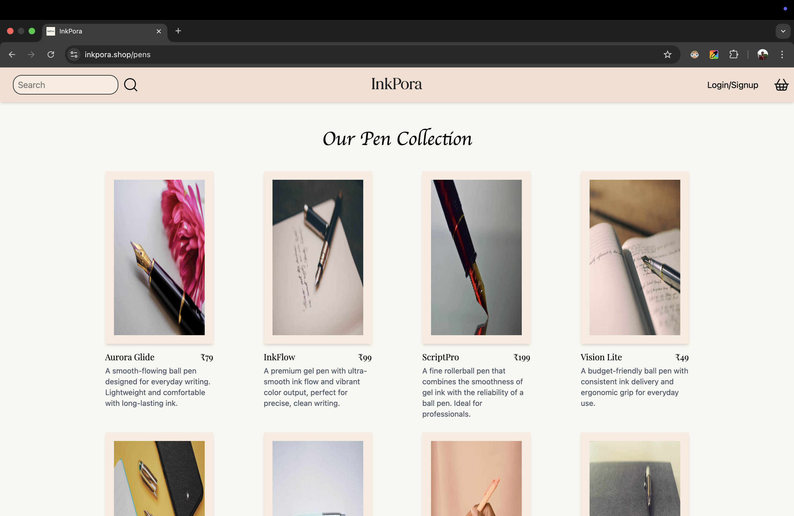
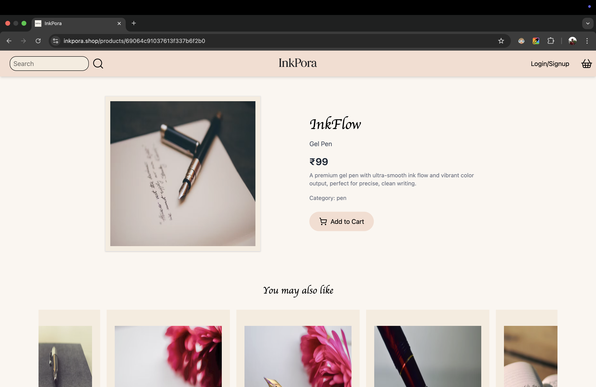

# InkPora

**InkPora** is a modern e-commerce web application for premium stationery and creative products.  
Built with the **MERN stack**, it features a smooth shopping experience, secure authentication, and a visually appealing design.

---

## Tech Stack

### Frontend

- React (Vite)
- React Router
- Axios
- Tailwind CSS
- Embla Carousel
- Lucide Icons

### Backend

- Node.js + Express
- MongoDB + Mongoose
- JWT Authentication
- Bcrypt Password Hashing
- CORS

### Deployment

- Frontend → [Vercel](https://vercel.com)
- Backend → [Render](https://render.com)
- Database → [MongoDB Atlas](https://www.mongodb.com/atlas)

---

## Live URLs

- **Frontend:** [https://www.inkpora.shop](https://www.inkpora.shop)
- **Backend API:** [https://api.inkpora.shop](https://api.inkpora.shop)

---

## Features

✅ User Authentication (Signup / Login / JWT-based sessions)  
✅ Product Management (MongoDB Models)  
✅ Dynamic Product Carousel  
✅ Search Functionality (by name, category, etc.)  
✅ Shopping Cart System  
✅ Responsive UI (Mobile + Desktop)  
✅ Fully Deployed (Frontend + Backend + Database)

---

## Screenshots

### Homepage

### Listings Page

### Product Page

### Phone View

---

## Author

**Shashwat**  
Building InkPora — a minimalist stationery brand with an aesthetic touch.

[www.inkpora.shop](https://www.inkpora.shop)

---

## License

This project is licensed under the **MIT License**.
